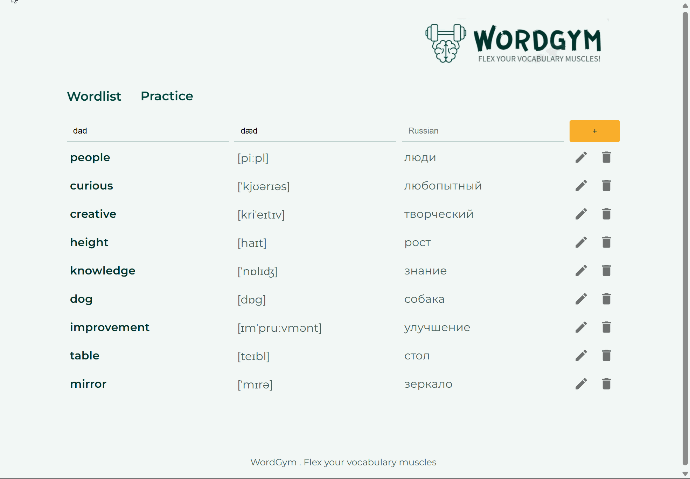

# 📚 WordGym — English Vocabulary Trainer

_An interactive single-page application designed to help users train their English vocabulary._

## 📽 Preview

## Overview

WordGym is a vocabulary training app where users can manage their personal word lists.

## Pages

- **Main Page** — displays a list of words to learn. Users can:
  - Add new words  
  - Edit existing words  
  - Delete learned words
- **Training Page** — card-based interface for memorizing vocabulary from the word list
- **Error Page** — shows message in case of errors

## Technologies Used

### `React`

- Single Page Application architecture
- Routing with React Router
- State management via **MobX + Context API**
- Functional components

### `CSS`

- Module styles for scoped styling
- Flexbox
- Styled interactive elements (buttons, links)

### `Material UI (MUI)`

- UI components for faster development
- Custom styling for MUI elements to match the project’s theme

### `API`

- Words are managed via RESTful API

### `Deployment`

- Live on GitHub Pages  
  [Check out WordGym](https://anna-lazakovich.github.io/WordGym/)
